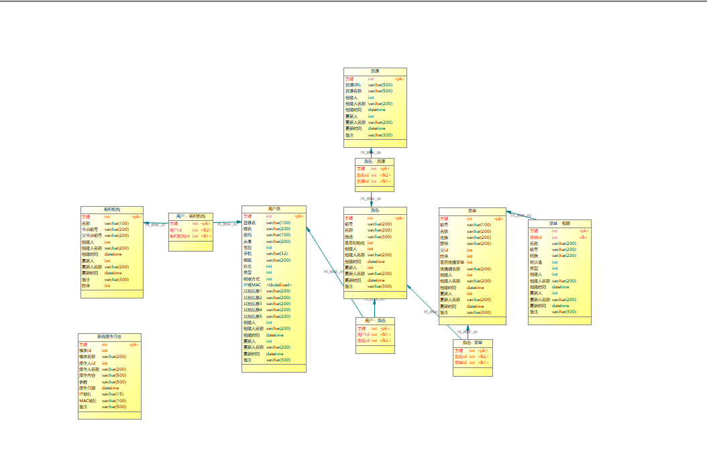

# 1. 项目介绍
**适用于前后端分离的后端快速开发平台**

**基于Spring Boot 2.0版本，集成MyBatis、Spring Security、Redis、Thymeleaf、Swagger、Quartz、ActiveMQ、
Log4j2高性能日志框架、邮件发送、多线程接口等功能的快速开发平台，下载即可开发。**

# 2. 架构设计

# 3. 内置功能

**RBAC基础权限功能**

**切面日志**

**消息队列**

**Swagger开发文档**

**Redis缓存**

**Quartz定时器**

**多线程功能**

**异常统一处理**

# 4. 相关博客

**SpringBoot之多module项目创建-基于Spring Boot2.x版本：[链接](https://blog.csdn.net/weixin_39723544/article/details/83058455)**

**SpringBoot之整合Redis分析和实现-基于Spring Boot2.x版本：[链接](https://blog.csdn.net/weixin_39723544/article/details/80743074)**

**SpringBoot之整合Swagger2分析和实现-基于Spring Boot2.x版本：[链接](https://blog.csdn.net/weixin_39723544/article/details/81085387)**

**SpringBoot之整合Quartz调度框架-基于Spring Boot2.x版本：[链接](https://blog.csdn.net/weixin_39723544/article/details/83382000)**

**SpringBoot之整合Thymeleaf-基于Spring Boot2.x版本：[链接](https://blog.csdn.net/weixin_39723544/article/details/82721279)**

**SpringBoot之War和Jar包部署-基于Spring Boot2.x版本：[链接](https://blog.csdn.net/weixin_39723544/article/details/82012827)**

...

# 5. 后续功能

**移除MyBatis，依赖JDBC封装JDBC**

**工作流**

**项目模块化**

...

