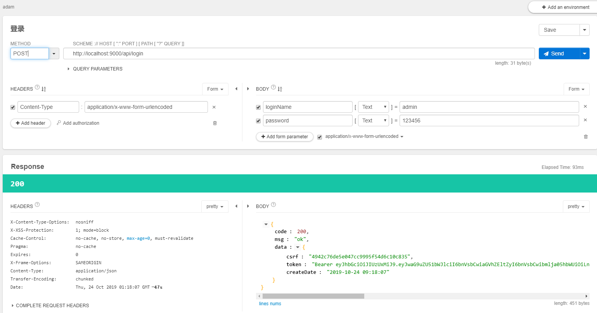
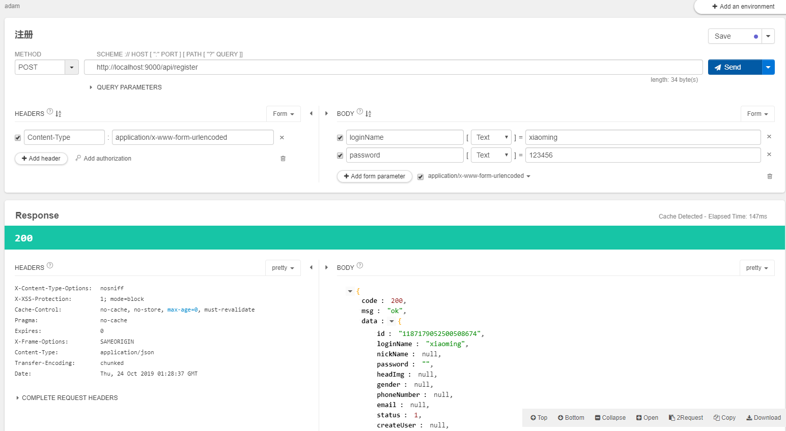
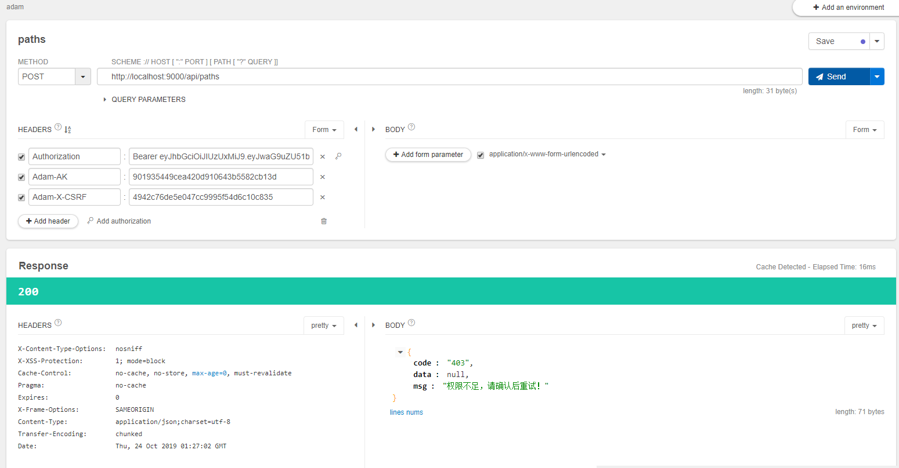
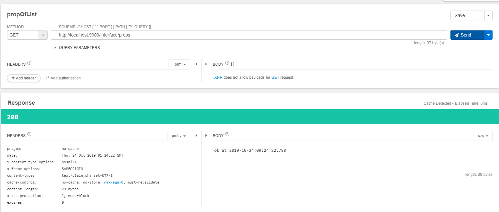

## 简介
framework 是一个基于 Spring Boot 2.2.0.RELEASE 和 MyBatis 构建的快速开发的种子项目，适用广大的中小型公司构建API、Restful API的脚手架。该项目从众多实际项目中剥离出来，简单、易用、易拓展，加快我们开发的速度，减少我们苦逼的加班。

## 框架特性
- 简单的项目结构、明确的业内技术规范
- 集成常见RBAC权限控制模型，做到方法级别的细粒度权限控制
- 统一的相应结果封装，便于前后端调试
- 异常统一处理，开发模式下返回详细异常信息，生产环境屏蔽后台错误
- 对多线程开发进行封装，简化企业级的线程开发的难度
- 集成Druid连接池和监控技术
- 使用Mybatis-Plus来简化Dao层开发，做到单表业务无SQL。屏蔽复杂的PageHelper分页插件，使用内置的IPage进行分页，简单便捷
- 拦截常见CSRF攻击和SQL注入，保护Web安全
- 使用JWT保护token安全，并使用拦截器弥补token的有效期的缺点
- 特别适合前后端后分离的项目开发(无缝与Vue、Flutter、Android、IOS)衔接
- 基于当前最新的Spring Boot 2.2.0.RELEASE稳定版，尝鲜最新特性

## 环境要求
- JDK 8+
- Maven 3.3+
- Redis 3.0+
- MySQL 5.5+

## 快速上手
1. `clone`项目
2. 在数据库初始化`init.sql`脚本，并修改相应的数据库连接信息
3. 安装Redis(单机版Redis和Redis Cluster均支持)，启动后在配置文件中修改相应的连接信息
4. 项目启动成功
5. 注册一个接口的调用端，获取accessKey。默认客户端为`901935449cea420d910643b5582cb13d`
6. 默认的初始化用户名和密码是admin（123456）
6. 使用Restful工具进行接口测试。注意所有非`/interface`开头的接口均需在头部或请求体中携带`access-key`, `token`, `csrf`这三个参数，用于用户身份校验及其他功能实现

## 开发建议
- Java代码规范建议参考《阿里巴巴Java开发手册》（[最新版下载](https://github.com/lihengming/java-codes/blob/master/shared-resources/%E9%98%BF%E9%87%8C%E5%B7%B4%E5%B7%B4Java%E5%BC%80%E5%8F%91%E6%89%8B%E5%86%8CV1.3.0.pdf))
- 不建议使用`@autowired`进行注入，建议使用`CHERRY.SPRING_CONTEXT.getBean(xxx.class)`获取Spring容器中的bean
- 建议系统接口以`/api`开头，给第三方暴露的接口,不需要认证的接口以`/interface`开头
- 建议所有业务代码均按照JavaDoc的方式编写注释，尤其当你参与到一些比较大的项目时，你就知道我为啥把规范放到技术的前面
- 数据库设计：表名命名规范 `业务模块_tableName`;列名命名规范 `name` `login_name` 多个单词使用下划线，切勿使用关键字
- 工具类：建议先从`apache-commons-*` 和 `guava` 里面找，避免重复造轮子
- 接口文档：建议使用SwaggerUI、[ShowDoc](https://github.com/star7th/showdoc)等

## 调用示例

1. 登录接口

保存`csrf`和`token`.用于后续的需要鉴权的接口使用。

2. 注册接口

3. 系统接口(拥有权限)

以`/api/example`接口为例。通过rbac的关系我们可以看出admin用户拥有操作其接口的权限。

返回`200`，去数据库查看example发现多一条新纪录。而在传递头部参数的时候，如果`csrf`、`token`、`ak`有任意一个不传和传递错误的，后台都会报出相应的错误提示。

4. 系统接口(没有权限)

以`/api/paths`接口为例。通过rbac的关系我们可以看出admin用户**不拥有**操作其接口的权限。

返回`403`，提示权限不足。此时头部传递三个头部参数。

5. 第三方接口

以`/interface/props`接口为例。

通过结果发现`调用成功`。而此时头部并没有传递任何参数。

## 技术文档
- Spring Boot （[查看Spring Boot学习&使用指南](https://docs.spring.io/spring-boot/docs/2.2.0.RELEASE/reference/html/getting-started.html#getting-started)）
- MyBatis（[查看官方中文文档](http://www.mybatis.org/mybatis-3/zh/index.html)）
- MyBatis-Plus（[查看官方中文文档](MyBatisb通用Mapper插件（[查看官方中文文档](https://mapperhelper.github.io/docs/)）)）
- Druid Spring Boot Starter（[查看官方中文文档](https://github.com/alibaba/druid/tree/master/druid-spring-boot-starter/)）
- FastJSON（[查看官方中文文档](https://github.com/Alibaba/fastjson/wiki/%E9%A6%96%E9%A1%B5)）
- ...

# License
个人爱好，开源分享， 欢迎大家[Star](https://github.com/gyoomi/framework/stargazers) & [Fork](https://github.com/gyoomi/framework/network/members) 的支持。

